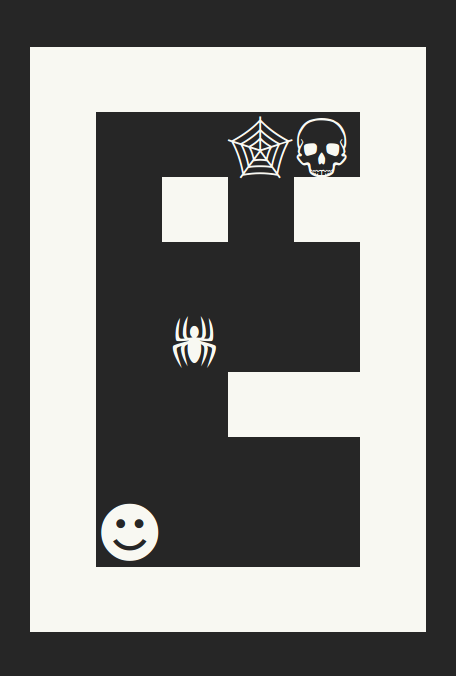

# FP Sokoban

A Sokoban game written in the functional programming style. Makes heavy use of currying, mapping, pipes and other [Ramda.js features](ramdajs.com/docs/). 100% variable free!

## Why?

To have a small illustration of functional programming concepts.

It is recommended to read the code in this order:

File | Content
-----|--------
data.js | data types, very basic
game.js | game logic, uses mappings, currying etc.
cli.js | command line "GUI", uses IO monads/promises

## Installation

	$ npm install -g fpsokobanjs
	$ fpsokobanjs

## How to play

* Move around by entering a direction, either as WASD, HJKL or .OEU followed by the ENTER key, e.g. enter w to move up.
* You control the spider. The goal is to move the smileys onto the spider webs.
* You can only push one smiley at a time.
